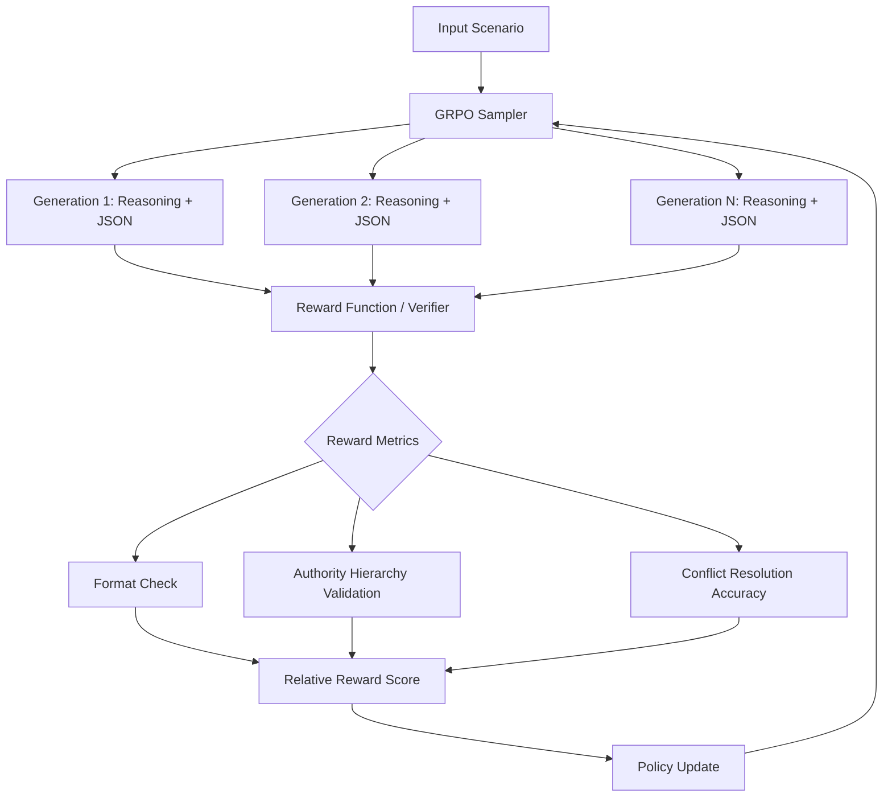

# System Architecture: ConflictBench

ConflictBench is built on a **Dual-Process Reasoning Framework** that combines Large Language Model (LLM) generation with a deterministic **Authority Verification Engine**.

## 1. Core Training Loop: GRPO (Group Relative Policy Optimization)

ConflictBench utilizes the GRPO algorithm to optimize for high-precision business reasoning without the need for a separate value-head model.

## 2. The Conflict Resolution Engine

The engine identifies and resolves conflicts based on three primary pillars:

### A. The Authority Hierarchy
Instructions are weighted by the seniority of the stakeholder.
*   **Level 4 (Executive)**: CEO, Board. Overrides all.
*   **Level 3 (Strategic)**: Department Heads, VP.
*   **Level 2 (Tactical)**: Project Managers, Team Leads.
*   **Level 1 (Operational)**: Individual Contributors.

### B. Temporal & Budgetary Constraints
The model must detect when an instruction violates a hard deadline (e.g., "by Friday") or a financial limit (e.g., "no new spending").

### C. Resolution Logic
The model doesn't just "pick a winner." It must:
1.  Identify the **Direct Contradiction**.
2.  Reference the **Stakeholder ID** and their **Authority Level**.
3.  Propose a **Synthesis** or an **Override** based on the hierarchy.

## 3. Training Infrastructure
*   **Compute**: Optimized for NVIDIA L40S / A100 environments.
*   **Memory Efficiency**: Utilizes Unsloth 4-bit quantization and LoRA (Rank=64) to allow training on a single 24GB-48GB GPU.
*   **Deployment**: Dual-track system (HF Spaces for inference/demo, Colab/Local for high-intensity training).
